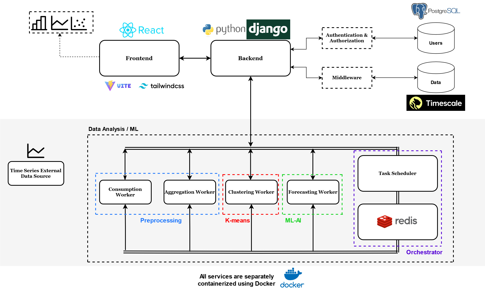

# Wattwise: AI driven predictive analytics and energy consumption monitoring

An intuitive platform designed to enhance energy management by integrating diverse consumption data and offering advanced forecasting capabilities.

## System Architecture

The system architecture, depicted in Figure 1, comprises nine services. Each service is independent and extensible, ensuring that the system remains adaptable and future-proof. This design choice enhances the platform's ability to evolve and incorporate new advancements without disrupting existing functionalities. We chose to structure the Wattwise platform with nine distinct services to enhance modularity, scalability, and specialization. This modular approach allows each service to be developed, tested, and maintained independently, facilitating updates and improvements without disrupting the entire system. Independent scalability ensures optimal resource allocation, allowing services to handle varying workloads efficiently. Specialization enables each service to be optimized for specific tasks, improving overall performance and reliability. This design also enhances system resilience, as the failure of one service does not impact others, and future-proofing, allowing seamless integration of new technologies and methodologies. Additionally, isolated services improve security by enabling tailored protection measures for each component. Below we will dive into each service independently.

*Figure 1: System Architecture Overview*

### Frontend

This component is the graphical user interface of the application, accessible by users to examine insights and visualizations. Its main purpose is to provide a user-friendly platform for interaction with the platform. It uses React, alongside Vite for optimized build tooling, and Tailwind CSS for responsive, design-forward components.

### Backend

Serving as the core of the system, the backend is multifaceted. It manages user authentication and authorization, serves content to the frontend, and functions as an API, simplifying data exchange between the data analysis and the database. It is built using Django, a high-level Python web framework for rapid development and clean, pragmatic design. Coupled with Django, the Django Rest Framework (DRF) is employed to implement RESTful architecture, simplifying the creation of web APIs with its modular and customizable components.

### Database

The database acts as the central repository for the system, storing critical user authentication information and application data. It secures data integrity and accessibility for the application's needs. This is a setup of PostgreSQL equipped with the TimescaleDB plugin to enable efficient analysis of time-series data. TimescaleDB is designed to handle high rates and query workloads that are common in time-series data use cases.

### Task Scheduler

Operating as the orchestrator, this service is responsible for task assignment and job scheduling across the system. It monitors user data, implements error handling, and secures the system's operational health. The Task Scheduler, operating alongside Redis as an orchestrator within the system, is tasked with systematically distributing jobs to various workers: Consumption, Aggregation, Clustering, and Forecasting.

### Redis

Redis is an in-memory data structure store, commonly used as a database, cache, and message broker. In this architecture, it's used as a message broker for queuing jobs from the Task Scheduler, which are then processed by the worker services.

### Clustering Worker

Specialized in performing clustering tasks, this worker processes data essential for the application's functionality. It pulls tasks from Redis, retrieves necessary data via the backend, and commits the processed data back to the database. The Clustering Worker uses clustering algorithms, such as K-means, to determine the cluster to which a consumer belongs based on various personal details, including house specifications, personal and family conditions, among others.

### Consumption Worker

Assigned the role of acquiring consumption data, this worker is responsible for gathering and storing the necessary information. It executes tasks queued in Redis and communicates with the backend for data transactions and storing results in the database. This worker is capable of fetching data from various sources, including APIs, static files such as CSVs, HD5, and JSON, among others. Its high level of configurability allows for data processing at varying granularities, with the flexibility to upsample or downsample data.

### Forecasting Worker

Responsible for generating forecasts based on consumption data, this worker feeds predictions for the consumption into the application. It accesses consumption data through the backend and ensures the forecasted data is stored in the database. Its design accommodates the use of a wide range of Machine Learning (ML) and Deep Learning (DL) models, treating them as modular, interchangeable components.

### Aggregation Worker

This worker aggregates data that is already within the database, optimizing it for better utility in the application. It pulls data through the backend and processes it for analytical use. The Aggregation Worker enhances the performance of the platform by pre-computing statistical aggregations of consumption data. This approach is designed to simplify the calculation process, reduce computational complexity, and significantly improve user experience by avoiding the need to compute these aggregations on-the-fly.

---

The presented structure outlines interconnected services that form the data processing and visualization application. Each service, from the frontend to the various worker components, is designed with a specific role that contributes to the overall functionality and user experience. The backend acts as a central hub, supporting the frontend's content delivery, authentication, authorization, and data exchange between workers and the database. Task Scheduler and Redis working together enable perfect dispersion and processing of each task, thus providing a continuous flow in operation. The architecture system is modular by nature and scalable. It supports clustering data analysis, forecasting consumption, and many tasks of different levels of complexity. That modular nature allows services to be added, removed, or updated very easily without too much disruption of the whole system and provides, therefore, a flexible framework, which can easily adapt to any changes in requirements or scale of operation. On the other hand, resulting modularity is a form of scalability; it may ease increases in loads by independently scaling individual components as required, not the system as a whole. This would imply, then, as the demand on one of the services increases, more instances of this service would have to be deployed to be able to handle the extra load, therefore ensuring the system remains responsive and efficient. Each service in the ecosystem independently executes and thus recovers from failures.
